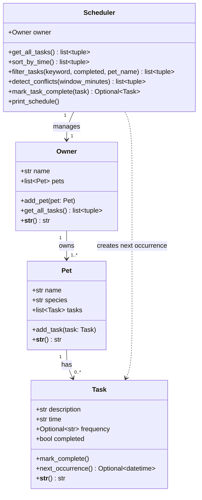

# PawPal+ — Final UML Class Diagram

Paste the Mermaid code below into https://mermaid.live to export as PNG.

## Key design notes

- `Task` is a pure data object — it knows about itself but not its parent
- `Pet` is a container — no scheduling logic, only `add_task()`
- `Owner` is the data root — `get_all_tasks()` flattens all (pet, task) pairs
- `Scheduler` is the only class with cross-object logic; it holds a reference to `Owner` and navigates down to `Task`
- Recurrence: `Scheduler.mark_task_complete()` calls `Task.next_occurrence()` (datetime arithmetic) then attaches the new `Task` to the correct `Pet`
